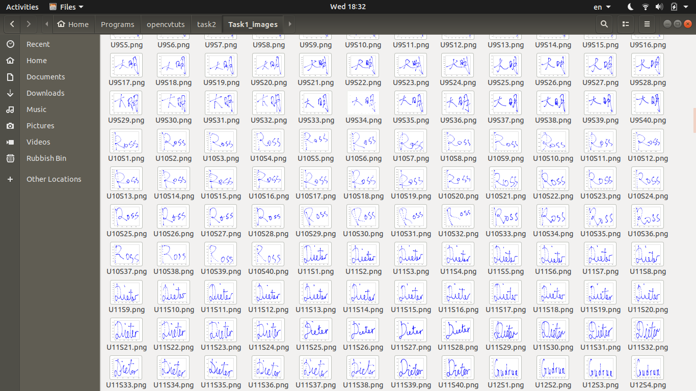
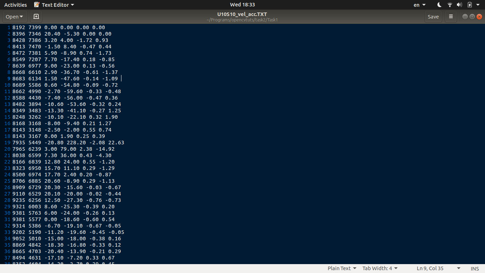
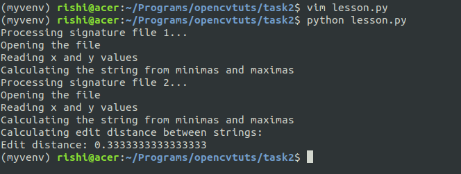
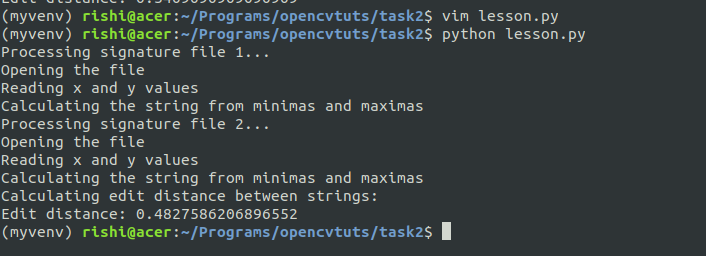

# Code symbols

xmin - A  
xmax - B  
ymin - C  
ymax - D  
xmin ymin - E  
xmin ymax - F  
xmax ymin - G  
xmax ymax - H 

# List of files:
- test.py - Plots signature and calculates velocity and acceleration for all 1600 files  
- edit.py - The edit distance logic used in the final program  
- lesson.py - The final program that calculates edit distance between two signatures 

Some screenshots:
All the plots:

